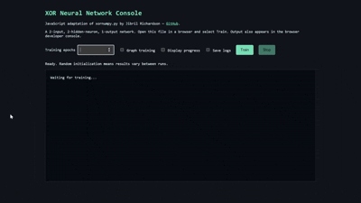

# XOR Neural Network From Scratch

A simple neural network written completely from scratch in Python.

This project demonstrates:
- Forward propagation
- Backpropagation
- Gradient descent
- Sigmoid activation
- Real-time training visualization
- Training logs
- XOR pattern learning

The network is trained to solve the XOR problem without using machine learning frameworks like TensorFlow or PyTorch.

---

# Requirements

Install dependencies with:

```bash
pip install -r requirements.txt
```
If you're using either program in a cli install tk for matplotlib to display the graphs with:

```bash
sudo apt install python3-tk
```

Current dependencies:
- matplotlib
- tensorflow

---

# Running The Project

Run the program with:

```bash
python xornumpy.py
```

The program will:
- Train a neural network
- Display a live error graph
- Show training progress
- Output final predictions
- Optionally save training logs

---

# Example Output

```text
[0, 0] -> 0.021
[0, 1] -> 0.981
[1, 0] -> 0.974
[1, 1] -> 0.018
```

---

# XOR Neural Net Webapp

Achieves the same functionality as the above program but in a webapp format.



# Project Goal

The goal of this project is educational:
to understand how neural networks work internally by building one from scratch using only Python and math.
